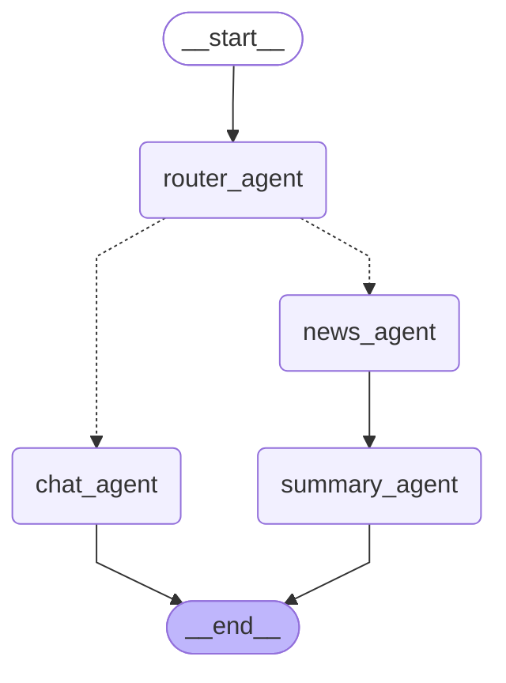

# Simple Chat Agent Server

LangGraph 기반 멀티 에이전트(LangChain 도구 포함)를 FastAPI로 스트리밍 서빙하는 최소 예제입니다. 라우터가 입력 의도를 판별하여 일반 대화/툴 호출(`chat_agent`) 또는 뉴스 수집→요약 파이프라인(`news_agent → summary_agent`)으로 보냅니다. SSE(EventSource)로 모델/툴 토큰을 실시간 전송합니다.

## 주요 특징

- LangGraph로 조건 분기 라우팅: `router → chat | news → summary`
- 세션 상태/체크포인트: `InMemorySaver` + `AgentState(messages, news, route)`
- 도구 통합: IP 지리/시간(`ip_info`), Google CSE 검색(`web_search`)
- RSS 수집 → 요약: NYT, Korea Times RSS를 비동기 수집 후 한국어 요약
- SSE 스트리밍: 모델 토큰(`on_chat_model_stream`), 툴 시작/종료 이벤트 전송

---

## 빠른 시작

### 1) 요구 사항

- Python 3.10+
- Google API Key, CSE ID (Google Programmable Search)

권장: [uv](https://github.com/astral-sh/uv) 사용(레포에 `uv.lock` 포함). pip만으로도 동작합니다.

### 2) 설치

uv 사용 시:
```bash
pip install uv            # 없으면 설치
uv sync                   # pyproject.toml/uv.lock 기반 의존성 설치
```

pip 사용 시:
```bash
python -m venv .venv && source .venv/bin/activate
pip install -U pip
pip install -e .
```

### 3) 환경 변수 설정(.env)

루트에 `.env` 파일을 두고 아래처럼 채웁니다.(`.gitignore`에 포함되어 있습니다)
```bash
# Gemini via langchain-google-genai
GOOGLE_GENAI_USE_VERTEXAI=False     # Vertex 사용 시 True 로 전환 및 별도 인증 필요
BASE_MODEL="gemini-2.5-flash"      # 기본값. 필요 시 변경

# Google Programmable Search (GoogleSearchAPIWrapper)
GOOGLE_API_KEY="<your_api_key>"
GOOGLE_CSE_ID="<your_cse_id>"
```

중요: 실제 키는 절대 공개 저장소에 커밋하지 마세요. 실수로 유출했으면 즉시 로테이션 하세요.

### 4) 서버 실행

```bash
uv run uvicorn main:app --reload
# 또는
uvicorn main:app --reload
```

브라우저에서 문서 확인: http://localhost:8000/docs (ReDoc: /redoc)

---

## API

### 세션 단위

- 모든 요청은 `/{session_id}` 경로를 사용합니다. `session_id`는 UUID 문자열입니다.
- 세션 상태는 LangGraph `InMemorySaver`에 저장되어, 프로세스가 재시작되면 사라집니다.

### GET `/{session_id}`

- 해당 세션의 상태 히스토리를 반환합니다.

예시
```bash
curl http://localhost:8000/00000000-0000-0000-0000-000000000001
```

### POST `/{session_id}` (SSE 스트림)

- JSON 바디로 `{"message": "..."}`를 보내면 SSE로 토큰/툴 이벤트를 스트리밍합니다.

예시
```bash
curl -N \
  -H 'Accept: text/event-stream' \
  -H 'Content-Type: application/json' \
  -d '{"message":"한국 테크 뉴스 요약해줘"}' \
  http://localhost:8000/00000000-0000-0000-0000-000000000001
```

스트림 이벤트 형식(서버 측 모델):
```json
{ "event": "on_chat_model_stream", "data": "토큰 조각..." }
```

툴 호출 이벤트:
```json
{ "event": "on_tool_start", "data": "{\"query\":\"kubernetes HPA\"}" }
{ "event": "on_tool_end",   "data": "<검색결과 요약 or RSS 항목 텍스트>" }
```

에러 이벤트:
```json
{ "event": "on_tool_error", "data": "..." }
{ "event": "on_chain_error", "data": "..." }
```

---

## 동작 개요(에이전트 구성)

### 라우팅 흐름


### RouterAgent
- 역할: 사용자의 최신 메시지를 보고 다음 노드(`chat_agent` 또는 `news_agent`)를 결정.
- 구현: `ai/router/agent.py` — LangChain `create_agent` + 구조화 출력.

### ChatAgent
- 역할: 일반 대화 + 도구 호출.
- 도구:
  - `ip_info`: IP 지리/타임존 조회. 루프백(`127.0.0.1`, `::1`)은 `8.8.8.8`로 대체 후 조회.
  - `web_search`: Google CSE로 웹 검색(최신성 있는 문서/공식 문서 검색에 적합).
- 구현: `ai/chat/agent.py` (+ `ai/chat/tools/*`).

### NewsAgent → SummaryAgent
- 역할: 뉴스 소스/피드 선택 → RSS 수집 → 요약 반출.
- 소스/피드(발췌):
  - `america` ([The New York Times](https://www.nytimes.com/rss)): `HomePage`, `World`, `US`, `Politics`, `Technology` 등
  - `korea` ([The Korea Times](https://www.koreatimes.co.kr/rss)): `AllNews`, `SouthKorea`, `Economy`, `Business`, `Entertainment` 등
- RSS 수집기: `ai/news/tools/rss_feed.py` — httpx 비동기 병렬, RSS/Atom 파싱, 간단 중복제거.
- 요약: `ai/summary/agent.py` — 리스트 입력을 한국어로 핵심 요약.  
**해당 rss에 feed가 없으면 `요약할 뉴스가 없습니다`로 표시됩니다.

---

## 디렉터리 구조(핵심)

```
ai/
  graph.py            # LangGraph 그래프(노드/엣지/체크포인터) 컴파일
  state.py            # AgentState(messages, news, route)
  agent.py            # astream_events → SSE 변환
  router/agent.py     # RouterAgent
  chat/agent.py       # ChatAgent (ip_info, web_search 도구)
  news/agent.py       # NewsAgent (RSS 선택/수집)
  news/tools/rss_feed.py  # RSS/Atom 파서/수집기
  summary/agent.py    # SummaryAgent (뉴스 요약)
main.py               # FastAPI 엔드포인트(GET/POST SSE)
pyproject.toml        # 의존성/빌드 설정
uv.lock               # uv 잠금파일
```

---

## 예시 시나리오

- 일반 대화/검색: `쿠버네티스 HPA 공식 문서 찾아줘`
  - Router → `chat_agent`
  - `web_search` 호출 → `on_tool_start`/`on_tool_end` → 모델 응답

- 날씨·위치류(데모): `127.0.0.1 시간 알려줘`
  - `ip_info` 도구 호출, 루프백은 8.8.8.8로 조회하여 타임존/현지시간 제공

- 뉴스 요약: `미국 테크 뉴스 5개만 핵심 요약`
  - Router → `news_agent` → `america/Technology` RSS 수집 → `summary_agent` 요약

---

## 트러블슈팅

- Google 검색 403/401: `GOOGLE_API_KEY`, `GOOGLE_CSE_ID` 확인. CSE에서 사이트 제한 설정 여부 점검.
- Gemini 인증 오류: `GOOGLE_GENAI_USE_VERTEXAI` 설정에 맞는 인증(키/서비스 계정) 준비 필요.
- SSE가 중간에 끊김: 프록시/게이트웨이의 타임아웃과 `Accept: text/event-stream` 헤더 확인.
- "모델 환경변수 없음": `BASE_MODEL` 미설정 시 `gemini-2.5-flash` 기본값 사용(코드에 반영).

---

## 개선 및 보안 사항

- 에러 타입 및 응답 포맷 통일(사용자 친화 오류 메시지)
- Router few-shot 보강 및 결정적 파라미터 조정
- 더 강력한 서치엔진 옵션(Tavily 등) 플러그형 추가
- 가드레일(입력 검증, 민감정보 차단, 응답 필터링)
